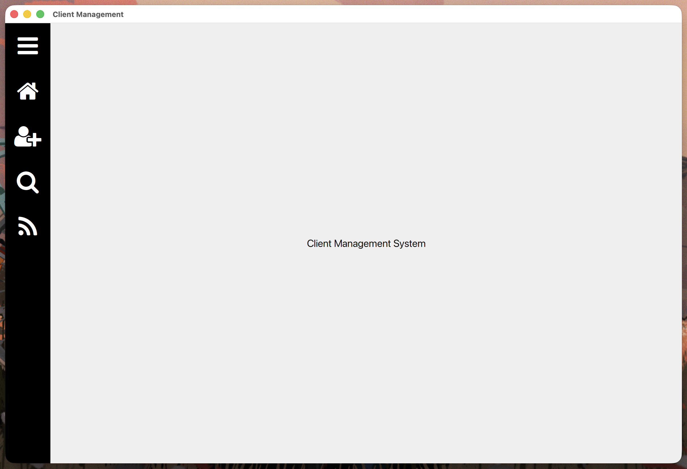
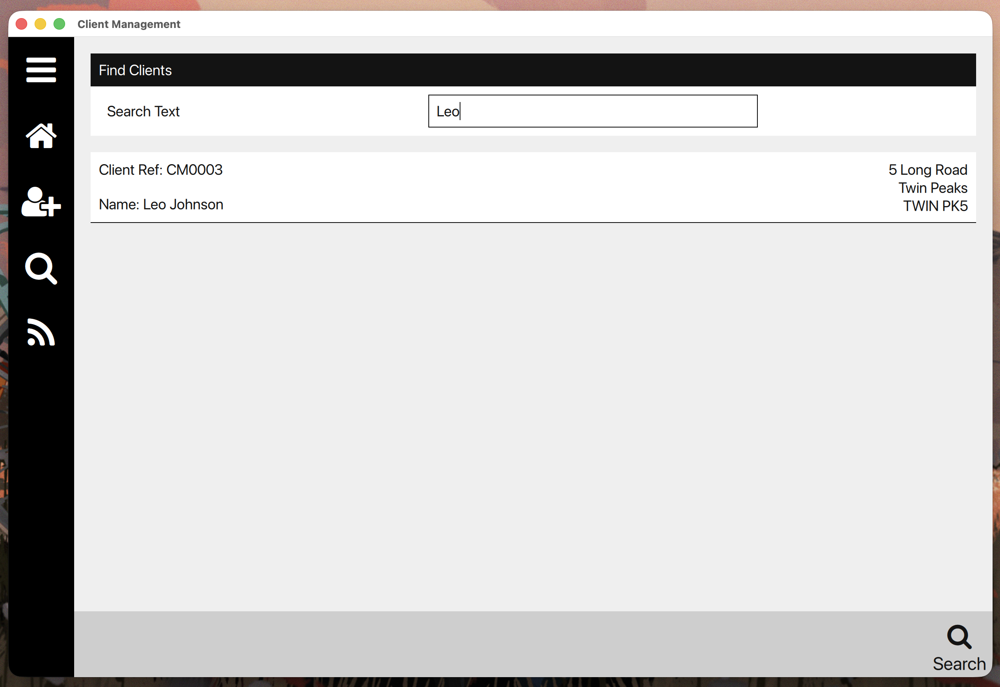
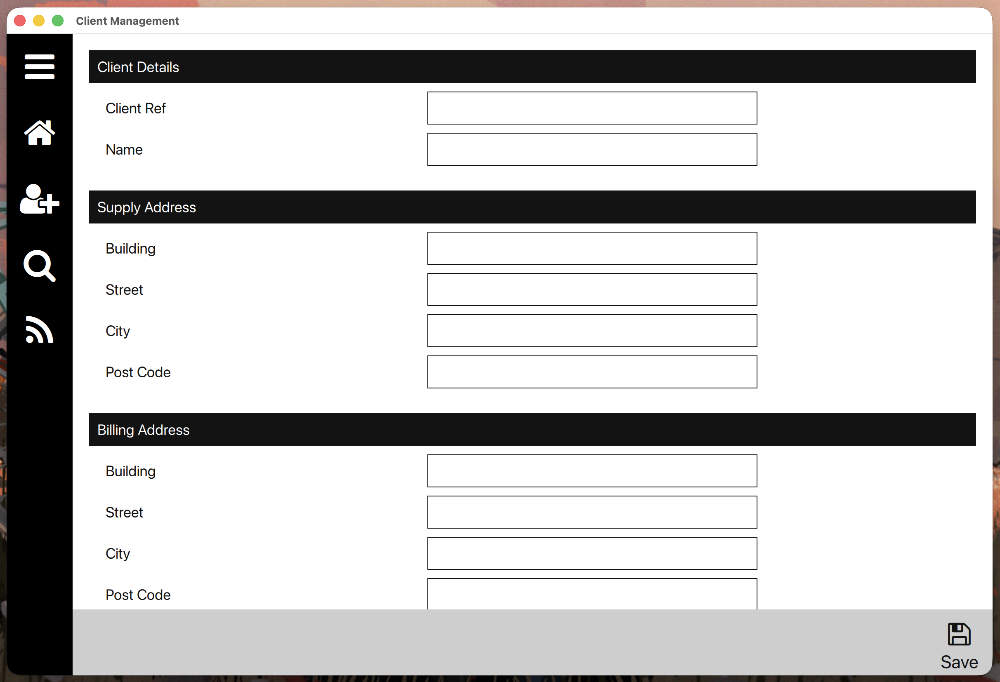
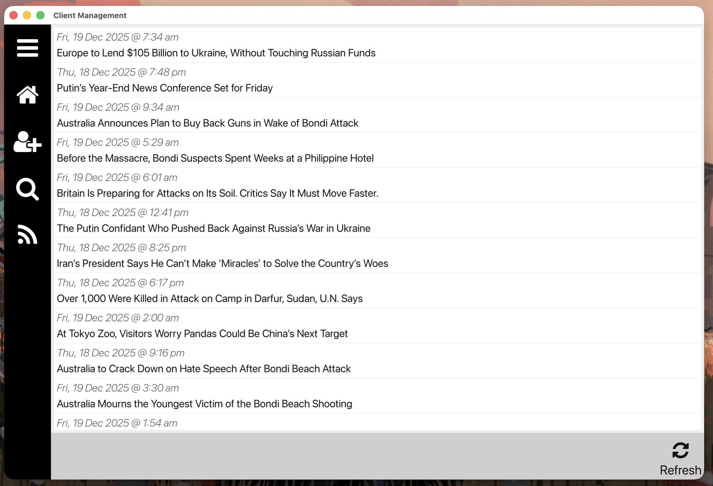

# Client Management Application

A comprehensive client management system built with Qt, demonstrating Qt development skills including QML for UI, C++ for backend logic, MVC architecture, and integration with RSS feeds.

## Overview

This application is a line-of-business (LOB) client management tool that provides essential CRUD (Create, Read, Update, Delete) operations for client data management. It features a modern QML-based user interface, robust C++ backend, and includes an RSS feed viewer for staying updated with news and industry information.

## Features

### Client Management

- **Add New Clients**: Create detailed client profiles with contact information, addresses, and appointments
- **Search Clients**: Powerful search functionality to quickly find existing clients
- **Edit Client Details**: Update client information with an intuitive editing interface
- **Delete Clients**: Remove client records with confirmation dialogs

### RSS Feed Integration

- **News Aggregation**: View RSS feeds for latest news and industry updates
- **Real-time Updates**: Automatic fetching and display of RSS content

### User Interface

- **Modern QML Design**: Sleek, responsive interface built with Qt Quick
- **Navigation System**: Intuitive navigation between different views
- **Form Validation**: Built-in validation for data entry
- **Command Pattern**: Robust command system for operations and undo/redo functionality

## Screenshots

### Home Dashboard



The main dashboard provides quick access to all major functions of the application.

### Client Search



Advanced search interface for finding clients efficiently.

### Add New Client



Comprehensive form for adding new client information.

### RSS Feed Viewer



Integrated RSS reader for news and updates.

## Architecture

This application follows the Model-View-Controller (MVC) architectural pattern, leveraging Qt's strengths in both C++ and QML development.

### Backend (C++)

- **Controllers**: Handle business logic and coordinate between models and views
  - `MasterController`: Main application controller
  - `NavigationController`: Manages view navigation
  - `CommandController`: Implements command pattern for operations
  - `DatabaseController`: Handles data persistence
- **Models**: Represent data entities (Client, Address, Contact, etc.)
- **Data Decorators**: Provide validation and formatting for data fields
- **Framework**: Command pattern implementation and object factory

### Frontend (QML)

- **Views**: Main application screens (Dashboard, Client forms, RSS viewer)
- **Components**: Reusable UI components (Editors, Buttons, Delegates)
- **Assets**: Styling and theming resources

### Key Technologies Demonstrated

- **Qt QML & Quick**: Modern declarative UI development
- **Qt C++**: High-performance backend development
- **Qt XML**: RSS feed parsing
- **MVC Pattern**: Clean separation of concerns
- **QML-C++ Integration**: Seamless communication between frontend and backend
- **Custom QML Components**: Reusable UI elements
- **Resource Management**: QRC files for assets and views
- **Cross-platform Build System**: QMake configuration

## Project Structure

```
cm/
├── cm.pro                 # Main project file
├── cm_lib/               # Core library
│   ├── cm_lib.pro
│   ├── source/
│   │   ├── controllers/  # Business logic controllers
│   │   ├── data/         # Data models and decorators
│   │   ├── framework/    # Command pattern & factories
│   │   ├── models/       # Domain models
│   │   ├── networking/   # HTTP client implementation
│   │   └── rss/          # RSS parsing and models
│   └── build/            # Build artifacts
├── cm_ui/                # User interface application
│   ├── cm_ui.pro
│   ├── source/main.cpp   # Application entry point
│   ├── views/            # QML view files
│   ├── components/       # Reusable QML components
│   └── assets/           # Styling and resources
├── cm_tests/             # Unit tests
│   ├── cm_tests.pro
│   └── source/           # Test implementations
├── binaries/             # Build outputs
└── images/               # Screenshots for documentation
```

## Build and Installation

### Prerequisites

- Qt 5.15 or later (Qt 6 recommended)
- C++14 compatible compiler
- QMake build system

### Building on macOS

1. Clone the repository:

   ```bash
   git clone <repository-url>
   cd cm
   ```

2. Configure the build:

   ```bash
   qmake cm.pro
   ```

3. Build the project:

   ```bash
   make
   ```

4. Run the application:
   ```bash
   ./binaries/macos/clang/arm64/cm_ui
   ```

### Building on Other Platforms

The project includes platform-specific configuration files:

- `qmake-target-platform.pri`: Platform detection
- `qmake-destination-path.pri`: Output path configuration

Adjust these files for your target platform and follow standard Qt build procedures.

## Usage

1. **Launch the Application**: Run the built executable
2. **Dashboard**: Start from the main dashboard
3. **Client Management**:
   - Use "Find Client" to search existing clients
   - Use "Create Client" to add new clients
   - Edit or delete clients from their detail views
4. **RSS Feeds**: Access news and updates from the RSS view

## Testing

The project includes comprehensive unit tests in the `cm_tests` subproject. Run tests using:

```bash
make test
```

## Skills Demonstrated

This project showcases expertise in:

- **Qt Framework**: Deep knowledge of Qt's ecosystem including QML, Quick, and C++ integration
- **Software Architecture**: Implementation of MVC and Command patterns
- **UI/UX Design**: Modern, responsive QML interfaces
- **Data Management**: Entity models with validation decorators
- **Networking**: HTTP client implementation for RSS feeds
- **Cross-platform Development**: Qt's platform abstraction
- **Build Systems**: QMake configuration and multi-target builds
- **Code Organization**: Modular library design with clear separation of concerns

## Contributing

This project demonstrates professional Qt development practices and serves as a portfolio piece. For educational purposes, feel free to explore the codebase to understand advanced Qt patterns and techniques.

## License

This project is developed for demonstration purposes. Please respect intellectual property and use as reference material only.
